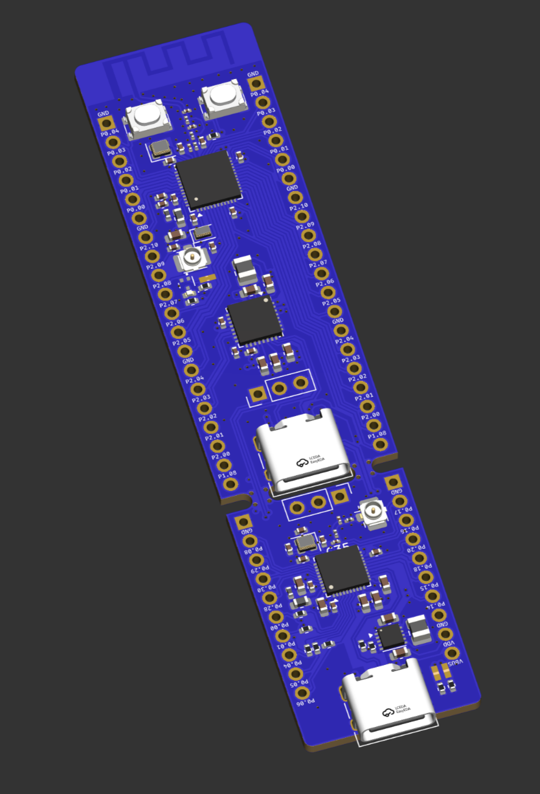
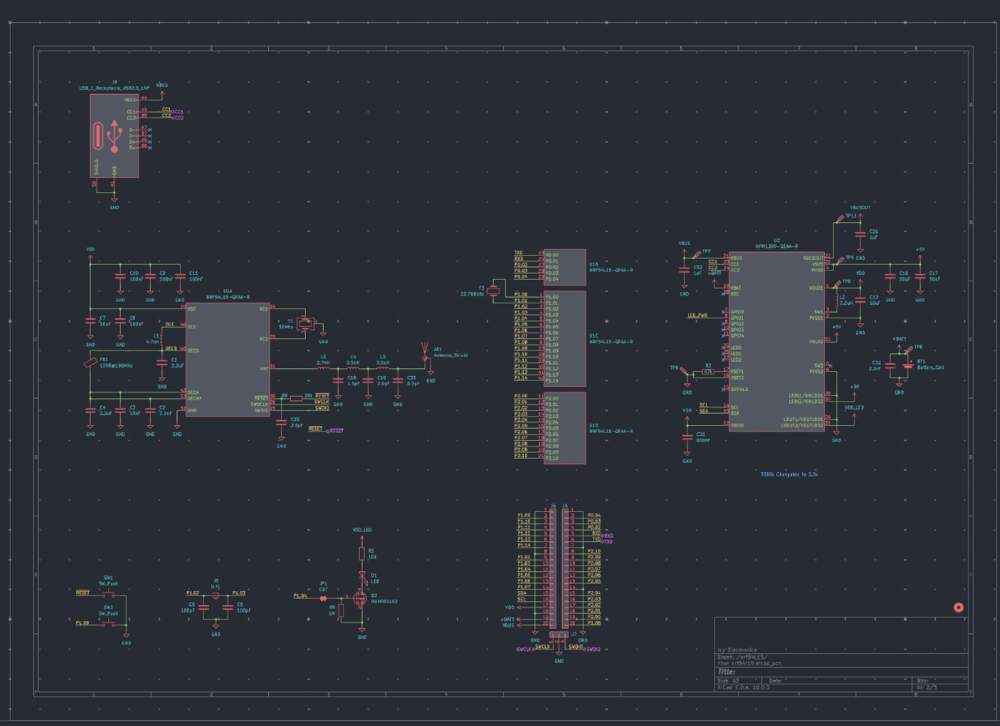
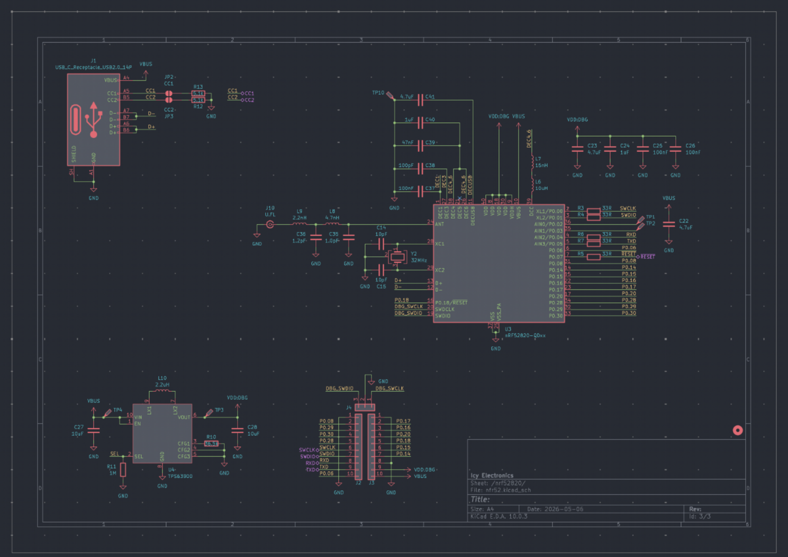
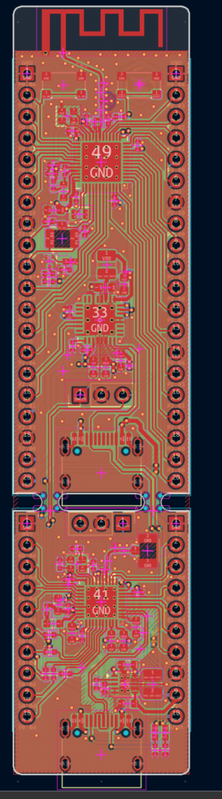

# nRF54L15 devboard

This is a nRF54L15 devoard with a nRF52820 support mcu and a nPM1300 PMIC. The board supports logic I/O levels from 1.7V to 3.3V, adjustable in 100mV steps.

The top-board also allows battery input, allowing ultra low pwoered operation

Bottom board acts as a portable programmer, but can also be broken in half to act as a standalone bluetooth IC

Both schematics can act as standalone modules and be used sperately, they communicate only via a SDIO and UART bus.

The nrf54L15 is also equiped with an external 32.768kHz oscillator, in order to improve battery efficiency.

Cost:

- PCB: 27$
- Stencil: 7$
- Components $56
- Shipping: Depends on region
